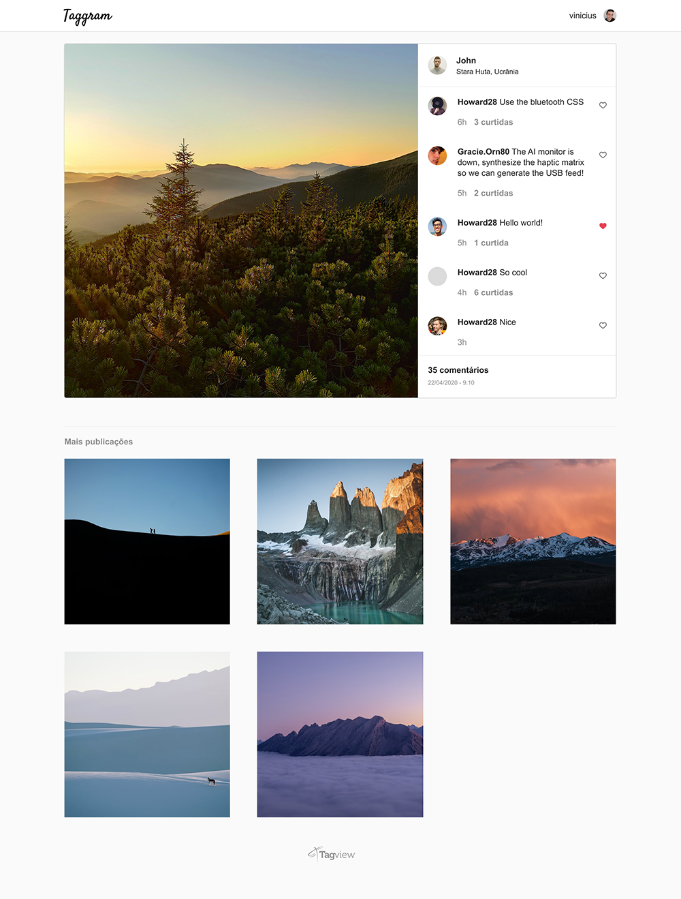

# Taggram

Olá!

Estamos empolgados que você se interessou em fazer parte da equipe Tagview! Montamos um desafio baseado em um problema semelhante aos que resolvemos no nosso dia a dia para conhecer um pouco mais sobre você.

## Implementação
Taggram é um site onde os usuários conseguem publicar comentários em uma foto.

A sua implementação deve se basear no [layout](#layout), obter os dados através da [API](#api) e seguir os [requisitos](#requisitos).

Em [/base](base) você encontra um esqueleto da aplicação com alguns exemplos, leia o código com atenção e implemente a sua solução a partir dele.

### Layout
Você pode visualizar o layout [clicando aqui](https://www.figma.com/file/96DdmM0aScr0uihjwx6LxM/Taggram?node-id=0%3A1). Ao se cadastrar no Figma você terá acesso às medidas, espaçamentos, cores e poderá baixar os ícones utilizados no layout. Também disponibilizamos [um protótipo](https://www.figma.com/proto/96DdmM0aScr0uihjwx6LxM/Taggram?node-id=1%3A2&viewport=396%2C310%2C0.5317721962928772&scaling=min-zoom) que simula o funcionamento da página.

### API
Desenvolvemos uma API REST que deve ser utilizada para obter os dados dos usuários, publicações e comentários. Ela possui três endpoints, conheça cada um deles na [**documentação**](API.md). Use essa API à vontade durante o desenvolvimento.

### Requisitos
1. A aplicação deve exibir os dados da publicação, do usuário e permitir que ele envie comentários
2. Quando a requisição para [enviar um comentário falhar](API.md#atenção-warning), exibir um alerta avisando o usuário que o `Comentário não foi enviado, tente novamente`. Você pode usar o `Window.alert` ou outro componente visual para exibir essa mensagem
3. Você pode continuar a implementação sem nenhum framework ou escolher entre ReactJS, AngularJS ou VueJS
4. Você pode utilizar qualquer outra biblioteca que achar necessário (jQuery, por exemplo)
5. **As requisições para a API devem ser feitas client-side (no próprio navegador)**. **Não** queremos que você utilize JSP, ASP ou qualquer ferramenta server-side.

## Submissão
Envie o URL de um repositório git público por email para `team@tagview.com.br`. Usamos bastante o [GitHub](https://github.com) e o [GitLab](https://gitlab.com).

## Boa sorte!
Analisamos mais do que somente o resultado final então nos envie a sua solução mesmo se você encontrar problemas implementando algum detalhe.

### Critérios de avaliação
- Capacidade de assimilar um conteúdo novo
- Organização
- Atenção aos requisitos
- Preocupação com a usabilidade (experiência do usuário)
- Empenho em entregar algo, mesmo que minimamente funcional
- Tratamento de erros

Caso tenha dúvidas, envie um e-mail para `team@tagview.com.br` :technologist:
